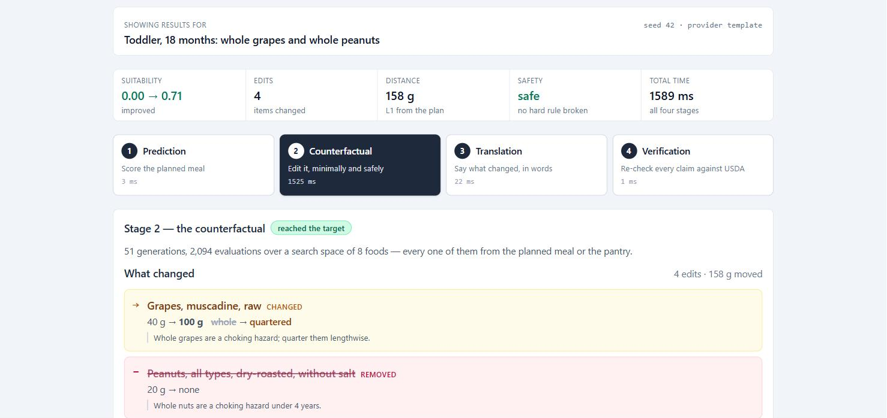
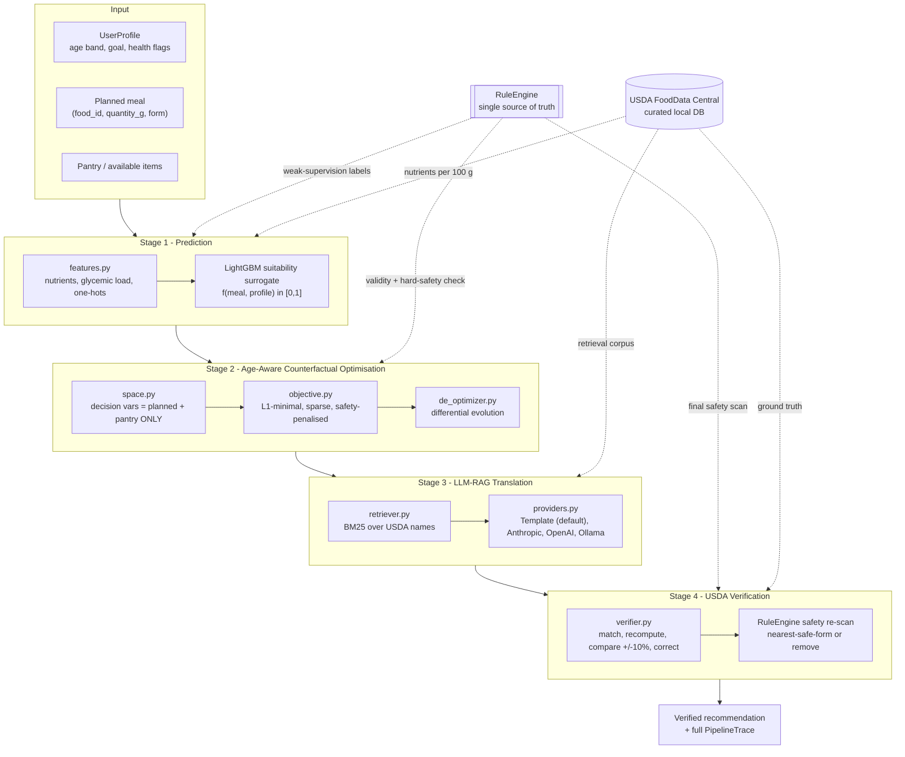

# FoodSense

**Tells you the smallest change to the meal you already planned, using only food you already have, so it is safe for who is eating it.**

[](https://github.com/aarush093/foodsense/actions/workflows/ci.yml)
[](https://www.python.org/downloads/)
[](LICENSE)
[](#quickstart)



<sub>A real run, captured from the app. A toddler's lunch of whole grapes and whole peanuts, repaired in 1.6 seconds — entirely offline, no API key.</sub>

- **The problem.** Diet advice tells people to eat things they do not have, and generic "healthy meal" suggestions ignore that whole grapes are a choking hazard at 18 months but quartered ones are not.
- **What is new.** The search space is built from the planned meal plus the pantry and *nothing else*, hazards are a property of `(food, preparation form)` so a grape can be fixed by quartering rather than deleting, and every generated claim is re-checked against USDA before display.
- **What was measured.** Over 300 cases: **0% availability violations, 0% safety violations, 100% safe** — while actively editing 3.03 items per meal, at the smallest distance of any method that edits at all (norm-L1 0.796).

**FoodSense reaches its nutrition target in 29% of cases — lower than the unconstrained baselines, and that is the design working.** Strip the safety and sparsity terms from the same search and validity rises to 34%, bought with a hard-safety violation in 35% of meals and nearly twice the edits. Widen the space to foods the user lacks and Wachter-style scores 34% valid but only **8% usable**: 76 of its 101 successes depend on an ingredient that is not in the kitchen. Validity itself is a dial — the `lambda_validity` sweep moves it from **2% to 66%**, with safety at **100% at every setting** and availability violations at 0% at every setting. Those two do not move because they are structural: an unavailable food has no decision variable to select, and the safety penalty outweighs any achievable gain. The weight was fixed at 5.0 in Phase 3, from that sweep, **before the 300-case comparison had been run** — because choosing it afterwards would be fitting a hyperparameter to the evaluation it is reported against. Validity is tunable. Safety is not a setting.

Full tables, the ablation ladder and the per-case decomposition are in [`results/`](results/) and summarised [below](#results).

---

## What this extends, and what is not verified

FoodSense extends **MetaPlate** (Arefeen, Johnston & Ghasemzadeh, IEEE JBHI 2026 —
arXiv:2606.10120), which pairs a postprandial-glucose predictor with a counterfactual
optimiser and an LLM-RAG translation layer, along five axes: availability-awareness,
modification-based editing, post-generation verification, generalised health goals, and
age/life-stage personalisation.

Every result in `results/` was regenerated from the shipped code and checked against a
hash manifest. No evaluation number appears in this repository until the script that
produces it has actually been run.

Two things are **not** verified, and are labelled as such wherever they appear: the
Docker build (Docker is not installed on the development machine, so it has never been
executed) and the LLM providers (no API key in the development environment — the offline
template path is the one that is exercised).

---

## Architecture



### The four stages

| Stage | Module | What it does |
|-------|--------|--------------|
| 1 · Prediction | `stage1_prediction/` | A goal-conditioned **meal-suitability surrogate** `f(nutrients, age_group, goal, health_flags) → [0,1]`, trained on weak-supervision labels from the guideline `RuleEngine`. It is the smooth objective the optimiser climbs — *not* the verifier. |
| 2 · CF optimisation | `stage2_optimizer/` | Differential evolution over `(quantity_g, form)` for every item in `planned_meal ∪ pantry` — and nothing else. Minimises `λ₁·(target − f) + λ₂·L1 + λ₃·sparsity` under hard safety penalties. |
| 3 · LLM-RAG translation | `stage3_rag/` | BM25 retrieval over USDA names grounds the optimised vector in real foods; a provider renders it as age-appropriate language. The default `TemplateProvider` is deterministic and needs no network. |
| 4 · Verification | `stage4_verification/` | Every generated item is re-matched to the USDA DB, its nutrients recomputed from ground truth, mismatches beyond ±10 % corrected, and a final hard-safety scan applied. |

### Why an ML model when we already have rules?

Because they do different jobs. The `RuleEngine` is a **discontinuous verifier** — ideal for
"is this meal safe and compliant?", useless as a search objective, because it gives an
optimiser no gradient to follow. The Stage-1 surrogate learns a **smooth, generalising
approximation** of guideline compliance that differential evolution can actually climb.
Validity is then judged by the rules, never by the surrogate, so the optimiser cannot game
its own model. This mirrors MetaPlate exactly, where the learned glucose model is distinct
from the 140 mg/dL threshold check. The long-form argument is in
[`docs/architecture.md`](docs/architecture.md).

---

## The five extensions over MetaPlate

| # | Extension | How it is implemented (not a promise — a file) |
|---|-----------|-----------------------------------------------|
| 1 | **Availability-aware** | `stage2_optimizer/space.py` builds decision variables *only* from `planned_meal ∪ pantry`. Unavailable foods are not penalised — they do not exist in the search space. |
| 2 | **Modification-based editing** | The optimiser starts from the user's own meal and pays `λ₂·L1 + λ₃·sparsity` for every gram and every item it touches. Pantry items start at 0 g, so a substitution only happens when it is worth its cost. |
| 3 | **Post-generation verification** | `stage4_verification/verifier.py` — match, recompute, compare, correct, re-scan. Its `VerificationReport` counts are the headline metric. |
| 4 | **Generalised health goals** | `configs/goals/{glycemic_control,weight_management,balanced_nutrition}.yaml`, layered with age-specific nutrient targets. |
| 5 | **Age/life-stage personalisation** | `configs/age_groups/{toddler,adult,older_adult}.yaml` — choking `(category, form)` bans with a nearest-safe-form map, medication–food interaction rules, and texture (IDDSI-style) constraints. |

**Choking hazards are a property of `(ingredient, preparation form)`, not of the ingredient.**
Whole grapes are unsafe for a toddler; quartered grapes are not. That is why every meal item
is a `(food_id, quantity_g, form)` triple — it lets the optimiser fix a hazard by changing the
*form*, which costs far less than removing the food.

---

## Quickstart

Requires Python 3.11+ (and Node 18+ only if you want the web UI).
**No API keys. No internet after setup.**

```bash
git clone https://github.com/aarush093/foodsense.git
cd foodsense

make setup    # create .venv, install dependencies
make data     # build the curated USDA food database
make train    # train the Stage-1 suitability surrogate
make demo     # run all three demo scenarios end-to-end

make serve    # build the UI and serve it + the API on http://127.0.0.1:8000
```

**No API key is needed and nothing reaches the network.** Every command above —
including the web UI — runs entirely locally against the committed USDA database
and the trained surrogate. An LLM is an optional enhancement for Stage 3, never a
dependency, and if you do not set a key the demo does not change behaviour: it
simply uses the deterministic template it always uses.

> **If you intend to demo the LLM path**, run it once beforehand:
> `foodsense recommend --scenario toddler_choking --provider anthropic`.
> The pinned model id is checked against Anthropic's published model list but has
> **not** been exercised against the live API from this repository — there is no
> key in the development environment. A wrong or retired id would surface as a
> 404 recorded in `trace.warnings`, with the template answer still returned, but
> you want to find that out in advance rather than on stage.

`make serve` binds **loopback only**. That is the entire security boundary and it
is deliberate: there is no auth because there is nothing here to authenticate
against, and binding every interface would turn a laptop demo into an
unauthenticated service on whatever network you are on.

<details>
<summary><b>Windows (no GNU make)</b></summary>

GNU `make` is not installed on Windows by default. `make.ps1` mirrors every target:

```powershell
./make.ps1 setup
./make.ps1 data
./make.ps1 train
./make.ps1 demo
./make.ps1 serve
```

Or drive the CLI directly, which is what `serve` does underneath:

```powershell
.\.venv\Scripts\python.exe -m foodsense.cli serve
.\.venv\Scripts\python.exe -m foodsense.cli serve --no-open --port 8080
```
</details>

Docker — **present but unverified**:

```bash
docker compose up --build     # -> http://127.0.0.1:8000
```

> The `Dockerfile` and `docker-compose.yml` are written and committed, but **Docker is
> not installed on the development machine, so this build has never been executed**.
> Treat it as untested: it may well need adjusting. Verifying it is a CI task, and it
> is the one item on the roadmap that is written down rather than demonstrated. The
> demo path does not involve Docker — use `make serve`, which is the path that is
> tested.

---

## Demo scenarios

| Scenario | Profile | The problem | What FoodSense does |
|----------|---------|-------------|---------------------|
| `toddler_choking` | Toddler, 18 mo, balanced nutrition + iron focus | Whole grapes and whole peanuts are choking hazards | Re-forms grapes to `quartered` (a form fix, not a removal); substitutes the peanuts from the pantry; verifies every quantity against USDA |
| `elderly_sodium` | Older adult, 78 y, hypertension | Canned soup + salted crackers blow the 500 mg/meal sodium cap | Minimal swap to low-sodium broth, chicken and carrots; final sodium verified ≤ 500 mg |
| `adult_weight` | Adult, weight management | Burger and fries — over the kcal cap, under the protein floor | Demonstrates the generalised-goal objective on a third goal profile |

```bash
foodsense recommend --scenario toddler_choking
foodsense demo                                  # all three
```

---

## Results

Every figure below came from a script in `experiments/` that actually ran, on the
committed data, at the seeds recorded in `configs/pipeline.yaml`. Regenerate them
all with `make eval`, then `make verify-results` to confirm nothing moved.

### The counterfactual comparison

300 sampled cases, 100 per age group, same evaluation budget for every method.
Full table and the reasoning in
[`results/cf_comparison.md`](results/cf_comparison.md).

| Method | Validity | Usable validity | Safe | Availability violations | Safety violations | norm-L1 | Edits |
|---|---|---|---|---|---|---|---|
| **FoodSense-DE** | 29% | **29%** | **100%** | **0%** | **0%** | **0.796** | 3.03 |
| Wachter (same space) | 34% | 34% | 65% | 0% | 35% | 0.927 | 5.78 |
| Wachter-style | 34% | 8% | 68% | 54% | 32% | 0.847 | 5.82 |
| DiCE-random | 41% | 20% | 74% | 29% | 26% | 0.825 | 1.95 |
| DiCE-genetic | 2% | 2% | 73% | 0% | 27% | 0.000 | 0.00 |
| Greedy | 52% | 29% | 77% | 50% | 23% | 0.884 | 3.83 |

**What FoodSense gets right, and why it is structural rather than tuned.** Across
300 cases it never once recommended a food the user did not have, and never once
left a hard-safety rule broken. Neither number is a weight that happened to work:
an unavailable food has no decision variable, so no point in the search space can
contain one, and no setting in `configs/pipeline.yaml` can change that. It also
moves the fewest grams of any method that edits at all (norm-L1 0.796).

**One of these baseline numbers improved because we fixed our own harness.**
DiCE-random was not reproducible: `generate_counterfactuals` was being called
without a seed, and DiCE's random sampler draws from the global RNG, so every run
was a fresh draw. Seeding it moved the row **in the baseline's favour** — validity
40% → 44% on the unseeded re-draw, settling at 41% once deterministic — and it is
reported that way because a competitor's number going up is exactly the kind of
correction that is tempting to leave unmade. The other five methods, FoodSense-DE
included, reproduced **bit-identically** across the regeneration, which is the
evidence that the pipeline is not quietly tuned toward its own result.

**Its validity is 29%, and that is lower than most of the baselines.** Greedy
reaches 52%, DiCE-random 41%. This is the number to argue with, so it is stated
here rather than buried, and the rest of this section is the explanation.

**The ablation ladder isolates the cost.** Three rows share one search algorithm,
one surrogate and one budget, and differ only in what they are allowed to do:

- Removing the safety and sparsity terms while keeping the same search space
  (**Wachter, same space**) buys 5 points of validity — 29% → 34% — and pays for
  them with **35% safety violations** and nearly twice the edits (5.78 vs 3.03).
  That is the whole trade, measured on identical cases.
- Widening the space to include foods the user lacks (**Wachter-style**) does not
  raise validity at all — still 34% — but 54% of its answers now reach for
  something that is not in the kitchen, so **usable validity collapses from 34% to
  8%**. Restricting the space costs nothing here and is also cheaper to search:
  the extra foods double the dimensionality without adding budget.
- **Greedy's 52%** is the honest high-water mark, and half of it evaporates the
  same way: 50% availability violations take usable validity to 29% — the same as
  FoodSense — while still leaving 23% of meals unsafe.

FoodSense, the same-space ablation and DiCE-genetic are the three rows where
validity and usable validity coincide. For the first two that is because the
search space contains only what the user has. For DiCE-genetic it is arithmetic:
it never edits anything.

**Validity is a dial; safety is not a setting.**
[`results/lambda_sweep.md`](results/lambda_sweep.md) sweeps `lambda_validity` over
90 cases at six settings:

| `lambda_validity` | 1 | 2 | 3 | **5 (shipped)** | 8 | 12 |
|---|---|---|---|---|---|---|
| Validity | 2% | 3% | 14% | **34%** | 51% | 66% |
| Safe | 100% | 100% | 100% | **100%** | 100% | 100% |
| Edits | 1.60 | 1.81 | 2.33 | **3.19** | 3.79 | 4.29 |

**These two tables are not measured on the same sample, so do not read the
difference as disagreement.** The sweep runs **90 cases** (30 per age group) at each
of six settings, because it re-optimises every case six times; the comparison table
above runs **300** (100 per age group). At the shipped weight the sweep reads 34%
against the comparison's 29% — the same code and the same seeds on a third of the
cases. **The 300-case figure is the one to quote**; the sweep is sized to show the
shape of the trade-off, not to place validity to the percentage point.

Validity moves from 2% to 66%; safety is 100% at every setting and availability
violations 0% at every setting. Those two are properties of the formulation, not
of the weight, and the sweep is the falsifiable form of that claim — if the terms
were genuinely commensurable, a large enough weight would eventually buy a
violation. None does.

**How the weight was chosen.** `lambda_validity: 5.0` was selected in Phase 3,
from a sweep of this shape, **before any comparison against the baselines had been
run**, as the smallest weight that materially improves the meal while keeping the
edit count near the two-edit scale of the proposal's worked example. It has not
been re-tuned since the 300-case table existed, deliberately: choosing a
hyperparameter after seeing the evaluation it will be reported against is fitting
to the evaluation set.

### Why the invalid cases are invalid

[`results/validity_decomposition.md`](results/validity_decomposition.md) sorts all
213 invalid FoodSense cases into three buckets, and the split matters because only
one of them is an optimiser result.

| Bucket | Cases | Share |
|---|---|---|
| **A** — a hard-safety rule still broken | 0 | **0%** |
| **B** — surrogate *and* rule engine agree the meal is short | 191 | **90%** |
| **C** — surrogate cleared the target, the rules did not | 22 | **10%** |

**Bucket A is empty**: no case is invalid because it was left unsafe.

**Bucket C is 10%, and it agrees with an independent measurement.** These are
meals the optimiser could not tell were invalid — its validity term
`max(0, target − surrogate)` had already reached zero, so the objective was flat
and there was no gradient left to climb. Its mean size is **0.0293**, against a
held-out surrogate residual of **0.0306** measured separately on the model alone
in [`results/surrogate_boundary.md`](results/surrogate_boundary.md). Two
independent measurements — one on the model, one on real optimiser output — landing
within 0.0013 of each other. The share is also stable across age groups
(12% / 10% / 9%), which is what a model-level property should look like and not
what a sampling artefact would.

That measurement also corrects a natural misreading of the Stage-1 report: the
headline ~0.058 RMSE is against the **deliberately noised** training label
(σ = 0.05). Against the clean rule-engine score — the quantity that actually
decides validity — the residual is 0.0306, and √(0.0306² + 0.05²) recovers the
reported figure.

**So the 29% is an honest optimiser result.** Nine invalid cases in ten are meals
the search knew were short and would not buy the edits to close. That is the trade
the sweep above measures, not a defect.

### Where counterfactual search has purchase

A finding that came out of testing a hypothesis that turned out to be wrong.
Among the 61 cases whose profile carries a hard sodium ceiling, the 18 whose planned
meal breached it end up valid **more** often than the 43 that started under it —
50% vs 30% — which looks like the safety constraint helping. It is not.

A hard-rule breach multiplies the composite score by 0.10, so a breaching meal is
*mechanically* at the bottom of the starting-score distribution: all 18 start
below 0.080, against a clean-meal range running to 0.736. Stratifying on the
starting score collapses the gap entirely — within the low stratum (n=30), breached
meals (n=18) are valid 50% of the time and clean ones (n=12) 50%.

**Read this as a direction, not an effect size.** The stratified comparison rests on
18 breaching meals against 12 clean ones; that is enough to say the convenient story
— that the hard ceiling depresses validity — is contradicted by the sign, and not
enough to put a number on the mechanism. The 300-case pattern below is the
better-powered version of the same claim.

The real mechanism is the shape of the validity term. It scales with distance
below target, so a meal starting near zero generates strong optimisation pressure
and can outspend the sparsity penalty (4.57 edits, +0.587 gain), while one already
in the mediocre middle generates weak pressure and stalls (2.84 edits, +0.194).
The pattern holds across all 300 cases: 40% validity below the line, 24% above it.
**Counterfactual search has the most purchase where there is the most to fix** —
which is the same population as bucket B, seen from another angle.

### Stage 4 catches what a generator gets wrong

Faults of the kinds a language model actually produces, injected into Stage-3
output and measured in [`results/verification_eval.md`](results/verification_eval.md).
**Every fault is deliberately injected**; these describe a capability, not any real
model's error rate.

Reported in two blocks, because pooling them would overstate what is measured.
Three faults are caught *by construction* — an id absent from the database fails a
dictionary lookup, a form drawn from the complement of a food's allowed forms
fails a membership test, a 1.9× claim against a 10% tolerance is outside it by
arithmetic. Those rates say the guards are wired up, not that the verifier is
capable:

| Detected by construction | Cases | Detected | Reached the user |
|---|---|---|---|
| `hallucinated_food` | 150 | 100% | **0%** |
| `impossible_form` | 150 | 100% | **0%** |
| `inflated_claim` | 150 | 100% | **0%** |

The rest require the verifier to independently recompute the meal from USDA, or
re-derive a hazard from the food, its form and the profile's age in months.
**This is the number that counts:**

| Detected by re-derivation | Cases | Mean shift in meal total | Detected | Reached the user |
|---|---|---|---|---|
| `quantity_drift` 1.10–1.15× | 150 | 3.1% | 29% | 71% |
| `quantity_drift` 1.15–1.30× | 150 | 6.5% | 71% | 29% |
| `quantity_drift` 1.60–3.00× | 150 | 42.1% | 95% | **5%** |
| `reintroduced_hazard` | 50 | — | **100%** | **0%** |

The drift bands are one mechanism at three magnitudes, and detection degrades
predictably as the fault approaches the tolerance. The tolerance is 10% of the
*meal total* while the fault multiplies *one item*, so the middle column is what
to read against it: where the shift sits below 10%, a miss is the tolerance doing
its job rather than the verifier failing, because flagging it would mean flagging
legitimate rounding too.

`reintroduced_hazard` is the fault the whole extension exists for — a generative
step silently undoing a safety decision the optimiser already made — and Stage 4
caught every one of 50.

### Known limitations

Stated plainly, because each of them is something a reader would otherwise find.

- **DiCE-genetic is a null row.** Every case reports
  `evaluation_budget_exhausted`. Its initialiser draws uniformly over every
  feature and keeps only draws that are *already* valid counterfactuals; on a
  sparse feasible region that condition is almost never met, so it spends the
  budget without converging. **Its 0% availability-violation rate is arithmetic,
  not a guarantee** — a method that adds nothing cannot add something unavailable,
  and that is not the same claim as FoodSense's 0%, which holds while actively
  editing 3.03 items per case. Its honest column is the 27% safety-violation rate:
  the planned meals' own hazards, left in place.
- **DiCE-random is partly budget-limited** on the harder cases, so its 41% is an
  optimistic reading of a method that did not always run to completion.
- **Two of the three demo scenarios do not clear the 0.70 target**, and both are
  pinned that way in the test suite rather than quietly excluded. `elderly_sodium`
  is held short by per-meal micronutrient floors that no single meal can satisfy —
  the sodium ceiling itself is met. `adult_weight` is held short by the
  calibration gap above: the surrogate scores it 0.7007 and the rule engine
  0.6793.
- **The LLM providers are code-complete but not runtime-verified.** There is no
  API key in the development environment, so the offline template path is the only
  one exercised end to end. See the note in the Quickstart.

### The three demo scenarios

| Scenario | Rule score | Clears 0.70? | What changed |
|---|---|---|---|
| `toddler_choking` | 0.005 → **0.710** | yes | Grapes **quartered**, not removed; whole peanuts out; ground chicken in from the pantry |
| `elderly_sodium` | 0.026 → 0.613 | no | Sodium **1,413 → 492 mg**, inside the 500 mg per-meal ceiling |
| `adult_weight` | 0.279 → 0.679 | no | Fries and cola cut back, broccoli in; **621 → 477 kcal**, protein 25 g |

#### Reading the two that say "no"

Narrate this rather than discover it live — both are deliberate, and both are
pinned in the test suite so they cannot drift quietly.

The composite score is not the scenario's own goal. It also carries **per-meal
micronutrient floors**, and vitamin D in particular is something almost no
unfortified single meal supplies. `elderly_sodium` **meets the constraint it
exists to demonstrate** — sodium is under the ceiling — and is still held under
0.70 by those floors. Reporting it as a success would mean quietly dropping the
floors from the score.

`adult_weight` falls short for a different and more interesting reason. Its
weight-management targets are met; the optimiser's own validity term reached zero
because the **surrogate** scores the meal 0.7007, while the rule engine — which is
the judge, deliberately, so the optimiser cannot grade its own homework — scores it
0.6793. That 0.021 gap is Stage-1 calibration at the decision boundary, and it is
measured across the whole held-out set in
[`results/surrogate_boundary.md`](results/surrogate_boundary.md).

Both are recorded as `stage2_valid: False` in the golden-trace tests. A demo that
only pins the cases it wins is not pinned at all.

## Reproducibility

Everything is seeded and every artefact is regenerable from a clean clone.

| What | How |
|---|---|
| Seed | `SEED = 42`, set once in `configs/pipeline.yaml` and threaded through data sampling, label noise, the train/test split and every optimiser run |
| Regenerate all results | `make eval` (about 90 minutes, strictly sequential — `run_validity_decomposition` reads the rows `run_cf_eval` writes) |
| Confirm nothing moved | `make verify-results` — diffs `results/` against `results/MANIFEST.sha256` and classifies each change as IDENTICAL / EXPECTED / UNEXPECTED |
| Rebuild the food database | `make data` |
| Retrain Stage 1 | `make train` |
| Environment | Python 3.12, Node 24 (UI only); exact pins in `requirements.txt` and `frontend/package-lock.json` |

Clean-clone check, run before each release — and note the last two steps, which
exist because a defect once hid in exactly the gap between them:

```bash
git clone <url> fresh && cd fresh
python -m venv .venv && .venv/Scripts/python.exe -m pip install -r requirements.txt
.venv/Scripts/python.exe -m pip install -e .
.venv/Scripts/python.exe -m pytest                       # 543 passed
.venv/Scripts/python.exe -m foodsense.cli demo           # all three scenarios, offline
cd frontend && npm install && npm run build && cd ..
cd /some/other/directory                                 # <- deliberately not the clone
<path-to>/fresh/.venv/Scripts/python.exe -m foodsense.cli serve --no-open
```

Wall-clock and generation timestamps are the only things that legitimately differ
between two runs of the same code — `verify_results.py` knows that and ignores
them. Everything else is expected to be byte-identical, and when it was not, that
turned out to be a real bug both times.

Per-artefact commands, if you want one table rather than all of them:

```bash
python experiments/run_cf_eval.py                  # results/cf_comparison.*
python experiments/run_validity_decomposition.py   # results/validity_decomposition.*
python experiments/run_lambda_sweep.py             # results/lambda_sweep.*
python experiments/run_surrogate_boundary.py       # results/surrogate_boundary.*
python experiments/run_verification_eval.py        # results/verification_eval.*
python experiments/run_dataset_comparison.py       # results/dataset_comparison.*
```

---

## Repository layout

```
src/foodsense/
├── schemas.py             # MealItem(food_id, quantity_g, form), UserProfile, PipelineTrace
├── data/                  # USDA DB builder, fuzzy lookup, corpus loaders
├── constraints/           # RuleEngine, age rules, goal thresholds  <- single source of truth
├── stage1_prediction/     # features, weak-supervision labels, LightGBM/XGBoost training
├── stage2_optimizer/      # search space, objective, differential evolution, baselines
├── stage3_rag/            # BM25 retriever, LLM providers, translation
├── stage4_verification/   # the verifier
├── api/                   # FastAPI: /api/recommend, /api/scenarios, /api/foods
├── pipeline.py            # run_pipeline(profile, planned_meal, pantry) -> PipelineTrace
└── cli.py                 # foodsense recommend / demo / serve
frontend/                  # Vite + React + Tailwind single-page UI (built to dist/)
experiments/               # every script that writes into results/
configs/                   # goal + age-group YAML (sourced to NASEM DRI, AAP/CDC, AHA...)
docs/                      # architecture, evaluation, traceability, demo script
```

---

## Roadmap

- [x] **Phase 0** — scaffold, tooling, CI, schemas
- [x] **Phase 1** — data layer (curated USDA DB, Food.com + Nutrition5k loaders)
- [x] **Phase 2** — `RuleEngine`, guideline configs, Stage-1 surrogate
- [x] **Phase 3** — Stage-2 optimiser + DiCE/Wachter/greedy baselines
- [x] **Phase 4** — Stage-3 RAG + Stage-4 verifier + end-to-end pipeline
- [x] **Phase 5** — FastAPI + React UI, served from one origin, offline
- [x] **Phase 6** — full evaluation regenerated and verified against a manifest, docs, ship hygiene

---

## Demo recording

<!-- TODO(Phase 5): replace with docs/assets/demo.gif once the UI is recorded -->
*A recorded click-path of the faculty demo will be embedded here. The written click-path
lives in [`docs/demo_script.md`](docs/demo_script.md).*

---

## Team

<!-- ─────────────────────────────────────────────────────────────────────
     PLACEHOLDER — to be filled in by the project team.
     Nothing here is auto-generated and no names have been invented.
     ───────────────────────────────────────────────────────────────── -->

**Course:** BCSE497J — PROJECT-I
**Institution:** Vellore Institute of Technology

| Name | Registration number |
|------|---------------------|
| _TODO_ | _TODO_ |
| _TODO_ | _TODO_ |

**Guide:** _TODO_
**Department:** _TODO_

---

## Acknowledgements

- **MetaPlate** — Arefeen, Johnston & Ghasemzadeh, *IEEE Journal of Biomedical and Health
  Informatics*, 2026 (arXiv:2606.10120). The four-stage architecture FoodSense extends.
- **USDA FoodData Central** — Foundation Foods and SR Legacy, U.S. Department of Agriculture.
- **Food.com Recipes and Interactions** — Li et al., via Kaggle.
- **Nutrition5k** — Thames et al., Google Research.
- Guideline values are sourced to NASEM Dietary Reference Intakes, AAP/CDC infant and
  toddler feeding guidance, the Dietary Guidelines for Americans, AHA and ESPEN/ASPEN.
  Every threshold in `configs/` carries its source as a YAML comment.

## License and data provenance

The **code** in this repository is MIT — see [LICENSE](LICENSE). The **data** is
not ours to license, and is treated separately.

| Source | What is in this repo | Terms |
|---|---|---|
| USDA FoodData Central (SR Legacy, Foundation Foods) | `data/processed/` — a curated 2,590-food subset with the 33-nutrient vectors | Public domain (U.S. Government work) |
| Food.com Recipes and Interactions | `data/samples/foodcom_sample.csv` — 500 real rows, seeded sample | Upstream terms apply; see the dataset's own page |
| Nutrition5k (Google Research) | `data/samples/nutrition5k_sample.csv` — 300 real rows, seeded sample | Upstream terms apply; see the dataset's own page |

The two corpus samples are committed **only** so that a fresh clone can run the
pipeline and the full test suite with no network and no credentials. They are
small seeded extracts, not redistributions of the datasets: the full corpora are
downloaded into `data/raw/`, which is gitignored and never committed. Exact row
counts, extraction rules and seeds are in
[`data/samples/README.md`](data/samples/README.md), and the download sources in
[`data/README.md`](data/README.md).

Guideline thresholds are derived from published public-health guidance (NASEM DRI,
AAP/CDC, DGA 2020–2025, AHA, ESPEN/ASPEN, IDDSI). Each one carries its source as a
comment beside it in `configs/`. They are an implementation of published guidance,
not clinical advice, and this system is a capstone research prototype rather than a
dietary tool for real use.
