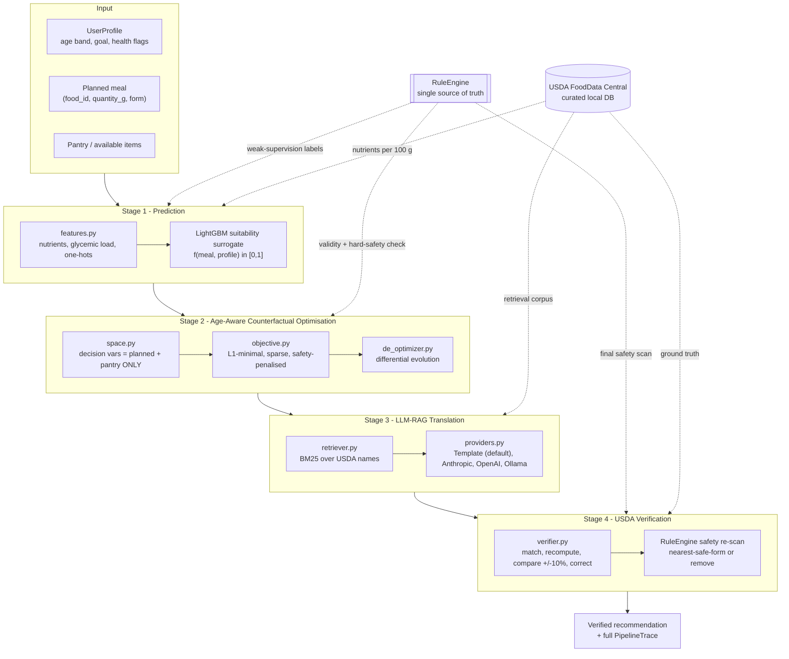

# FoodSense

**An Availability-Aware, Verification-Guided Counterfactual Food Recommendation System**

[](https://github.com/aarush093/foodsense/actions/workflows/ci.yml)
[](https://www.python.org/downloads/)
[](LICENSE)
[](#quickstart)

FoodSense takes the meal a person **actually planned to eat**, and the ingredients they
**actually have**, and computes the *smallest set of edits* that makes that meal meet their
health goal and their life-stage safety requirements — then verifies every gram of the
result against the USDA FoodData Central database before showing it to anyone.

It extends **MetaPlate** (Arefeen, Johnston & Ghasemzadeh, IEEE JBHI 2026 — arXiv:2606.10120),
which pairs a postprandial-glucose predictor with a counterfactual optimiser and an LLM-RAG
translation layer, along five axes: availability-awareness, modification-based editing,
post-generation verification, generalised health goals, and age/life-stage personalisation.

> **Status:** Phases 0–4 complete — **all four stages run end to end, offline, with no
> API key.** `make demo` walks the three scenarios from the proposal. The web UI and
> Docker packaging land in phases 5–6; see [Roadmap](#roadmap). No evaluation number
> appears in this repository until the script that produces it has actually been run —
> see `results/`.

---

## Architecture



### The four stages

| Stage | Module | What it does |
|-------|--------|--------------|
| 1 · Prediction | `stage1_prediction/` | A goal-conditioned **meal-suitability surrogate** `f(nutrients, age_group, goal, health_flags) → [0,1]`, trained on weak-supervision labels from the guideline `RuleEngine`. It is the smooth objective the optimiser climbs — *not* the verifier. |
| 2 · CF optimisation | `stage2_optimizer/` | Differential evolution over `(quantity_g, form)` for every item in `planned_meal ∪ pantry` — and nothing else. Minimises `λ₁·(target − f) + λ₂·L1 + λ₃·sparsity` under hard safety penalties. |
| 3 · LLM-RAG translation | `stage3_rag/` | BM25 retrieval over USDA names grounds the optimised vector in real foods; a provider renders it as age-appropriate language. The default `TemplateProvider` is deterministic and needs no network. |
| 4 · Verification | `stage4_verification/` | Every generated item is re-matched to the USDA DB, its nutrients recomputed from ground truth, mismatches beyond ±10 % corrected, and a final hard-safety scan applied. |

### Why an ML model when we already have rules?

Because they do different jobs. The `RuleEngine` is a **discontinuous verifier** — ideal for
"is this meal safe and compliant?", useless as a search objective, because it gives an
optimiser no gradient to follow. The Stage-1 surrogate learns a **smooth, generalising
approximation** of guideline compliance that differential evolution can actually climb.
Validity is then judged by the rules, never by the surrogate, so the optimiser cannot game
its own model. This mirrors MetaPlate exactly, where the learned glucose model is distinct
from the 140 mg/dL threshold check. The long-form argument is in
[`docs/architecture.md`](docs/architecture.md).

---

## The five extensions over MetaPlate

| # | Extension | How it is implemented (not a promise — a file) |
|---|-----------|-----------------------------------------------|
| 1 | **Availability-aware** | `stage2_optimizer/space.py` builds decision variables *only* from `planned_meal ∪ pantry`. Unavailable foods are not penalised — they do not exist in the search space. |
| 2 | **Modification-based editing** | The optimiser starts from the user's own meal and pays `λ₂·L1 + λ₃·sparsity` for every gram and every item it touches. Pantry items start at 0 g, so a substitution only happens when it is worth its cost. |
| 3 | **Post-generation verification** | `stage4_verification/verifier.py` — match, recompute, compare, correct, re-scan. Its `VerificationReport` counts are the headline metric. |
| 4 | **Generalised health goals** | `configs/goals/{glycemic_control,weight_management,balanced_nutrition}.yaml`, layered with age-specific nutrient targets. |
| 5 | **Age/life-stage personalisation** | `configs/age_groups/{toddler,adult,older_adult}.yaml` — choking `(category, form)` bans with a nearest-safe-form map, medication–food interaction rules, and texture (IDDSI-style) constraints. |

**Choking hazards are a property of `(ingredient, preparation form)`, not of the ingredient.**
Whole grapes are unsafe for a toddler; quartered grapes are not. That is why every meal item
is a `(food_id, quantity_g, form)` triple — it lets the optimiser fix a hazard by changing the
*form*, which costs far less than removing the food.

---

## Quickstart

Requires Python 3.11+ (and Node 18+ only if you want the web UI).
**No API keys. No internet after setup.**

```bash
git clone https://github.com/aarush093/foodsense.git
cd foodsense

make setup    # create .venv, install dependencies
make data     # build the curated USDA food database
make train    # train the Stage-1 suitability surrogate
make demo     # run all three demo scenarios end-to-end

make serve    # build the UI and serve it + the API on http://127.0.0.1:8000
```

`make serve` binds **loopback only**. That is the entire security boundary and it
is deliberate: there is no auth because there is nothing here to authenticate
against, and binding every interface would turn a laptop demo into an
unauthenticated service on whatever network you are on.

<details>
<summary><b>Windows (no GNU make)</b></summary>

GNU `make` is not installed on Windows by default. `make.ps1` mirrors every target:

```powershell
./make.ps1 setup
./make.ps1 data
./make.ps1 train
./make.ps1 demo
./make.ps1 serve
```

Or drive the CLI directly, which is what `serve` does underneath:

```powershell
.\.venv\Scripts\python.exe -m foodsense.cli serve
.\.venv\Scripts\python.exe -m foodsense.cli serve --no-open --port 8080
```
</details>

Docker:

```bash
docker compose up --build     # -> http://localhost:8000
```

---

## Demo scenarios

| Scenario | Profile | The problem | What FoodSense does |
|----------|---------|-------------|---------------------|
| `toddler_choking` | Toddler, 18 mo, balanced nutrition + iron focus | Whole grapes and whole peanuts are choking hazards | Re-forms grapes to `quartered` (a form fix, not a removal); substitutes the peanuts from the pantry; verifies every quantity against USDA |
| `elderly_sodium` | Older adult, 78 y, hypertension | Canned soup + salted crackers blow the 500 mg/meal sodium cap | Minimal swap to low-sodium broth, chicken and carrots; final sodium verified ≤ 500 mg |
| `adult_weight` | Adult, weight management | Burger and fries — over the kcal cap, under the protein floor | Demonstrates the generalised-goal objective on a third goal profile |

```bash
foodsense recommend --scenario toddler_choking
foodsense demo                                  # all three
```

---

## Results

Populated as each phase lands, and **only** from experiments that actually ran.
Regeneration instructions: [`docs/evaluation.md`](docs/evaluation.md).

Headline, over 300 sampled cases (100 per age group) — full table in
[`results/cf_comparison.md`](results/cf_comparison.md):

| Method | Usable validity | Safe | Availability violations | Safety violations | norm-L1 | Edits |
|---|---|---|---|---|---|---|
| **FoodSense-DE** | 29% | **100%** | **0%** | **0%** | **0.796** | 3.03 |
| Wachter (same space) | 34% | 65% | 0% | 35% | 0.927 | 5.78 |
| Wachter-style | 8% | 68% | 54% | 32% | 0.847 | 5.82 |
| DiCE-random | 17% | 76% | 32% | 24% | 1.024 | 2.05 |
| DiCE-genetic | 2% | 73% | 0% | 27% | 0.000 | 0.00 |
| Greedy | 29% | 77% | 50% | 23% | 0.884 | 3.83 |

Across 300 cases FoodSense never once recommended a food the user did not have and
never once left a safety violation in place, and it moved the fewest grams of any
method that edits at all (norm-L1 0.796). DiCE-random touches fewer items — 2.05
against 3.03 — but moves more mass when it does, which is the honest way to state
it. FoodSense is also the only row where validity and *usable* validity are the
same number; the others reach the nutrition target substantially by reaching for
ingredients that are not in the kitchen.

It reaches the target less often than an unconstrained search does, and
[`results/cf_comparison.md`](results/cf_comparison.md) isolates why: a same-space
ablation with the safety and sparsity terms removed buys a few points of validity
while producing 35% safety violations and nearly twice the edits. Validity is a
dial — [`results/lambda_sweep.md`](results/lambda_sweep.md) moves it from 2% to 66%
across `lambda_validity`, with safety at 100% and availability violations at 0% at
**every** setting. Validity is tunable; safety is not a setting.

[`results/validity_decomposition.md`](results/validity_decomposition.md) sorts every
invalid case into why. None are meals left unsafe. 90% are meals the search knew
were short and would not buy the edits to close — the trade the sweep measures — and
10% are a Stage-1 calibration limit, whose mean size (0.0293) is almost exactly the
surrogate's measured held-out residual (0.0306, see
[`results/surrogate_boundary.md`](results/surrogate_boundary.md)).

### Stage 4 catches what a generator gets wrong

[`results/verification_eval.md`](results/verification_eval.md) — faults of the kinds
an LLM actually produces, injected into Stage-3 output (every fault labelled as
injected):

Reported in two blocks, because pooling them would overstate what is measured.
Three faults are caught *by construction* — an id absent from the database fails a
dictionary lookup, a form drawn from the complement of a food's allowed forms fails
a membership test, a 1.9× claim against a 10% tolerance is outside it by arithmetic.
Those rates say the guards are wired up, not that the verifier is capable:

| Detected by construction | Cases | Detected | Reached the user |
|---|---|---|---|
| `hallucinated_food` | 150 | 100% | **0%** |
| `impossible_form` | 150 | 100% | **0%** |
| `inflated_claim` | 150 | 100% | **0%** |

The rest require the verifier to independently recompute the meal from USDA or
re-derive a hazard from the food, its form and the profile's age. **This is the
number that counts:**

| Detected by re-derivation | Cases | Mean shift in meal total | Detected | Reached the user |
|---|---|---|---|---|
| `quantity_drift` 1.10–1.15× | 150 | 3.1% | 29% | 71% |
| `quantity_drift` 1.15–1.30× | 150 | 6.5% | 71% | 29% |
| `quantity_drift` 1.60–3.00× | 150 | 42.1% | 95% | **5%** |
| `reintroduced_hazard` | 50 | — | 100% | **0%** |

The drift bands are one mechanism at three magnitudes. The tolerance is 10% of the
*meal total* while the fault multiplies *one item*, so the middle column is what to
read against it — below 10%, a miss is the tolerance doing its job rather than the
verifier failing. `reintroduced_hazard` is the fault the extension exists for: a
generative step silently undoing a safety decision the optimiser already made.

### The three demo scenarios

| Scenario | Rule score | What changed |
|---|---|---|
| `toddler_choking` | 0.005 → 0.680 | Grapes **quartered** (not removed); whole peanuts substituted; ground chicken added |
| `elderly_sodium` | 0.026 → 0.578 | Sodium **1,413 → 443 mg**, inside the 500 mg per-meal ceiling |
| `adult_weight` | 0.279 → 0.709 | Fries and cola out, broccoli in; 621 → 392 kcal, protein 24 g |

---

## Repository layout

```
src/foodsense/
├── schemas.py             # MealItem(food_id, quantity_g, form), UserProfile, PipelineTrace
├── data/                  # USDA DB builder, fuzzy lookup, corpus loaders
├── constraints/           # RuleEngine, age rules, goal thresholds  <- single source of truth
├── stage1_prediction/     # features, weak-supervision labels, LightGBM/XGBoost training
├── stage2_optimizer/      # search space, objective, differential evolution, baselines
├── stage3_rag/            # BM25 retriever, LLM providers, translation
├── stage4_verification/   # the verifier
├── pipeline.py            # run_pipeline(profile, planned_meal, pantry) -> PipelineTrace
└── cli.py                 # foodsense recommend / demo
api/                       # FastAPI: /api/recommend, /api/scenarios, /api/foods
frontend/                  # Vite + React + Tailwind single-page UI
experiments/               # every script that writes into results/
configs/                   # goal + age-group YAML (sourced to NASEM DRI, AAP/CDC, AHA...)
docs/                      # architecture, evaluation, traceability, demo script
```

---

## Roadmap

- [x] **Phase 0** — scaffold, tooling, CI, schemas
- [x] **Phase 1** — data layer (curated USDA DB, Food.com + Nutrition5k loaders)
- [x] **Phase 2** — `RuleEngine`, guideline configs, Stage-1 surrogate
- [x] **Phase 3** — Stage-2 optimiser + DiCE/Wachter/greedy baselines
- [x] **Phase 4** — Stage-3 RAG + Stage-4 verifier + end-to-end pipeline
- [x] **Phase 5** — FastAPI + React UI, served from one origin, offline
- [ ] **Phase 6** — full evaluation, docs, ship

---

## Demo recording

<!-- TODO(Phase 5): replace with docs/assets/demo.gif once the UI is recorded -->
*A recorded click-path of the faculty demo will be embedded here. The written click-path
lives in [`docs/demo_script.md`](docs/demo_script.md).*

---

## Team

<!-- ─────────────────────────────────────────────────────────────────────
     PLACEHOLDER — to be filled in by the project team.
     Nothing here is auto-generated and no names have been invented.
     ───────────────────────────────────────────────────────────────── -->

**Course:** BCSE497J — PROJECT-I
**Institution:** Vellore Institute of Technology

| Name | Registration number |
|------|---------------------|
| _TODO_ | _TODO_ |
| _TODO_ | _TODO_ |

**Guide:** _TODO_
**Department:** _TODO_

---

## Acknowledgements

- **MetaPlate** — Arefeen, Johnston & Ghasemzadeh, *IEEE Journal of Biomedical and Health
  Informatics*, 2026 (arXiv:2606.10120). The four-stage architecture FoodSense extends.
- **USDA FoodData Central** — Foundation Foods and SR Legacy, U.S. Department of Agriculture.
- **Food.com Recipes and Interactions** — Li et al., via Kaggle.
- **Nutrition5k** — Thames et al., Google Research.
- Guideline values are sourced to NASEM Dietary Reference Intakes, AAP/CDC infant and
  toddler feeding guidance, the Dietary Guidelines for Americans, AHA and ESPEN/ASPEN.
  Every threshold in `configs/` carries its source as a YAML comment.

## License

MIT — see [LICENSE](LICENSE).
